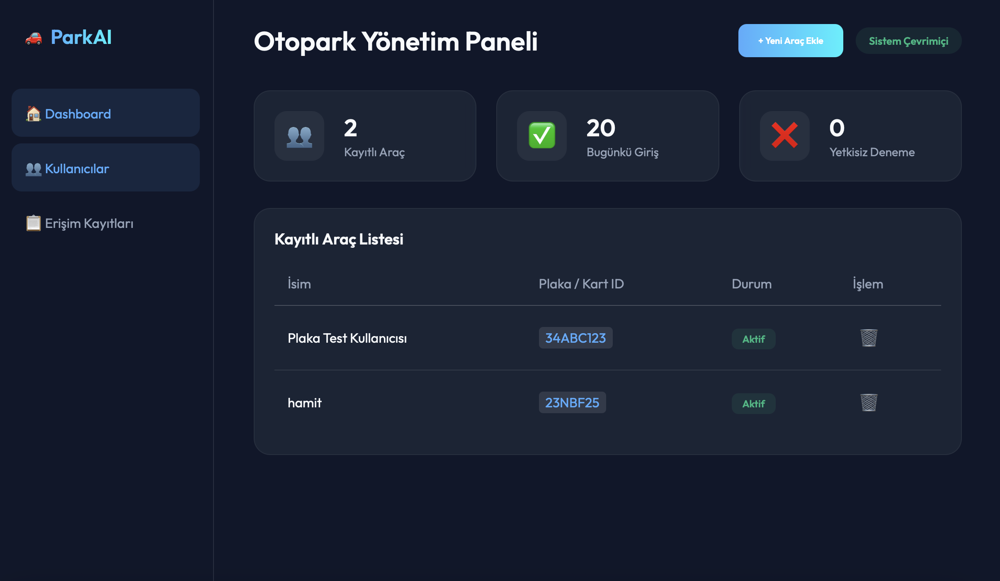
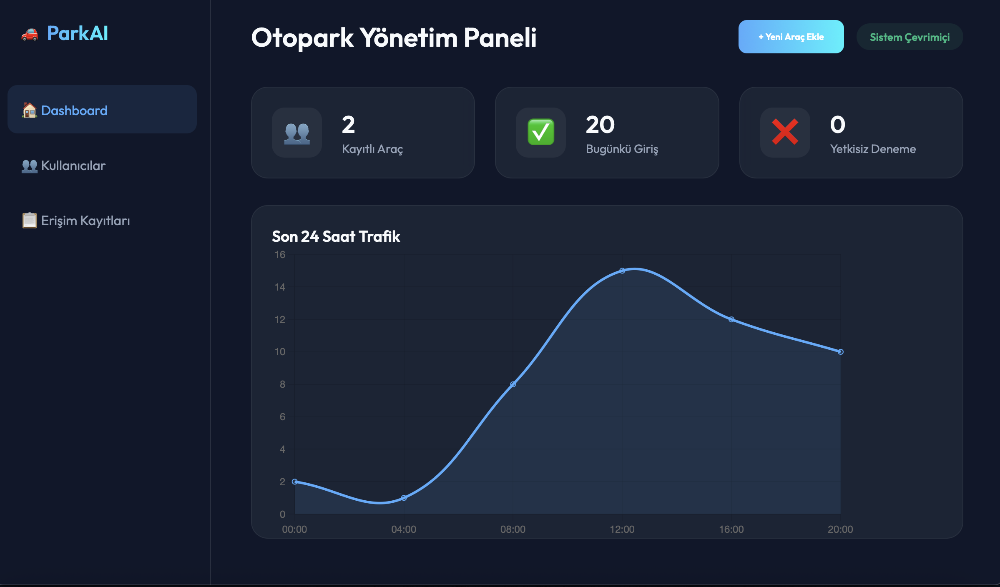
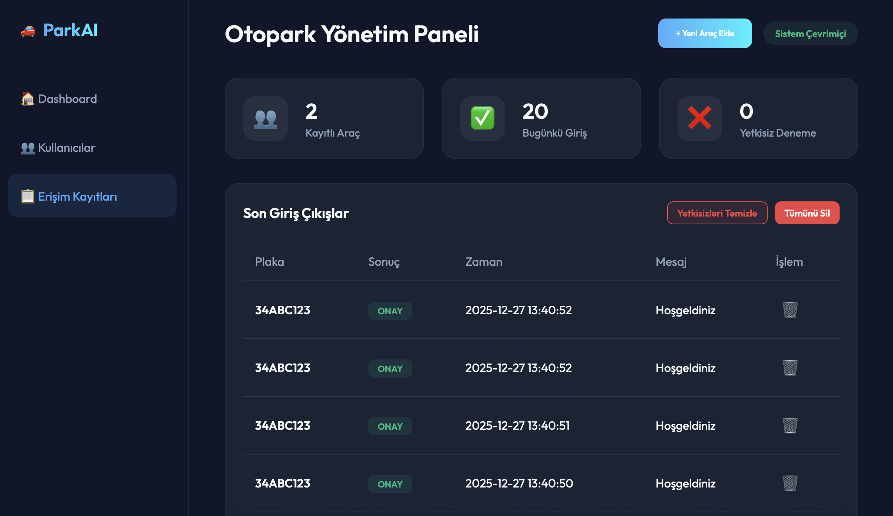

# 🚗 ParkAI: IoT Akıllı Otopark Sistemi

ParkAI, plakaları gerçek zamanlı olarak tanıyan, yetki kontrolü yapan ve modern bir yönetim paneli sunan tam kapsamlı bir otopark otomasyon sistemidir. Google Cloud Vision yapay zekası ile güçlendirilmiştir.

---

## 🌟 Önemli Özellikler

-   🧠 **Google Cloud Vision v4:** Dünyanın en iyi OCR motoru ile hatasız plaka tanıma (%99+ başarı).
-   📊 **Modern Dashboard:** Glassmorphism tasarımı ile anlık trafik, kullanıcı ve log takibi.
-   🐳 **Dockerize Mimari:** Saniyeler içinde kurulup çalıştırılabilen konteyner yapısı.
-   🛠️ **Yönetim Paneli:** Web üzerinden araç ekleme, silme ve gelişmiş log temizleme yetenekleri.
-   🔒 **Güvenli Erişim:** Sadece veritabanında kayıtlı olan araçlara giriş onayı (Servo kontrol hazırlığı).

---

<div align="center">
  
  <br><br>
  
  <br><br>
  
</div>

---

## 🛠️ Teknolojiler

-   **Backend:** Python & Flask
-   **Frontend:** Vanilla JS, CSS3 (Glassmorphism), Chart.js
-   **AI:** OpenCV & Google Cloud Vision API
-   **Database:** SQLite3
-   **DevOps:** Docker & Docker Compose

---

## 🚀 Hızlı Kurulum

### Docker ile Çalıştırma
```bash
docker-compose up --build
```

### AI Client'ı Başlatma (Plaka Okuma)
```bash
cd client
python3 plate_reader.py
```

---

## 🔮 Gelecek Planları (Phase 2)

-   [ ] **Arduino Integration:** ESP32-CAM ve Arduino üzerinden gerçek Servo motor kontrolü.
-   [ ] **Devre Şeması:** Fritzing/Tinkercad devre çizimlerinin eklenmesi.
-   [ ] **Fotoğraflı Log:** Giriş anında plakanın fotoğrafını çekip Dashboard'da gösterme.

---
*Bu proje, Antigravity AI yardımıyla profesyonel standartlarda geliştirilmiştir.*
